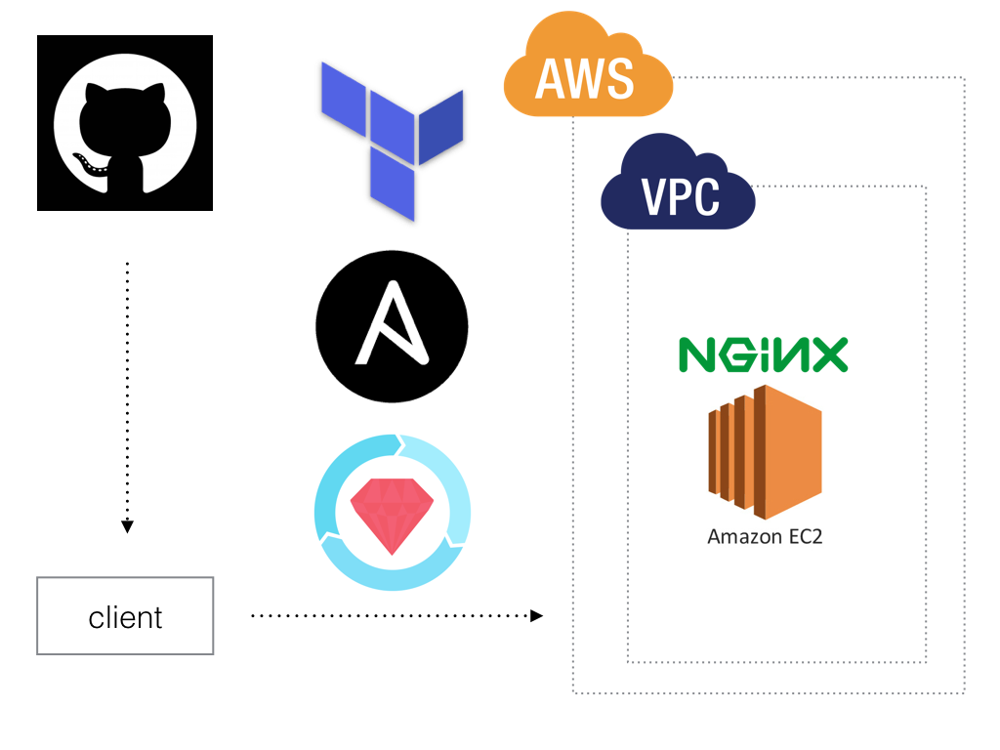

# Nginx Up and Running
[](https://circleci.com/gh/chaspy/nginx-up-and-running)

Learn about Nginx, AWS, and CI/CD.



## Includes
- AWS
  - EC2
- Nginx
- Terraform
- Ansible
- Infrataster

## Prepare

### Dependency

I confirm to work following software version.

```
$ terraform --version
Terraform v0.11.7
+ provider.aws v1.26.0

$ ansible --version
ansible 2.3.2.0

$ ruby --version
ruby 2.5.0p0 (2017-12-25 revision 61468) [x86_64-darwin15]
```

### Configuration

- input your credential

```
$ cp .secret.sample .secret
$ vi .secret
$ source .secret
```

You also add CircleCI as environment variables.

- exec `terraform init`
- exec `bundle install`

## Usage

You can deploy and test nginx on AWS using following command.

- exec `sh script/create.sh`

And you can login nginx-server.

```
$ ssh ec2-user@<ip addr>
```

## Vagrant
If you don't want to use AWS, you can work on Vagrant-VM.

```
$ vagrant up
```

You can run infrataster after this command.

- in local

  ```
  $ vagrant ssh
  $ bundle exec rspec
  ```

Also, your client machine can run the test to Vagrant-VM. Input the IP(192.168.33.100) to `spec/spec_hosts.rb`
